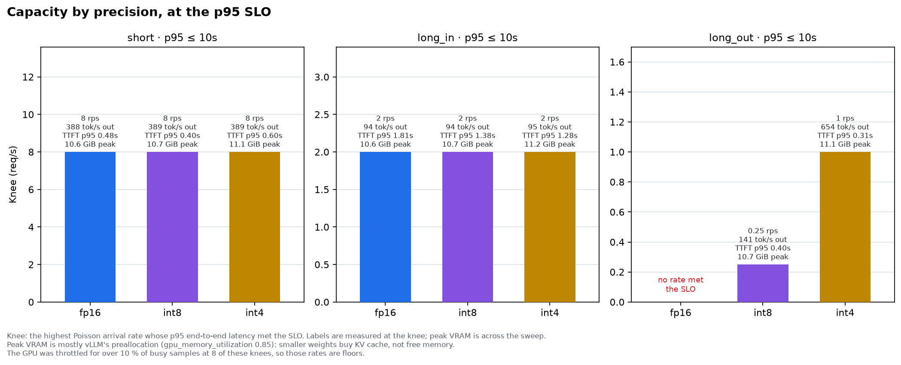
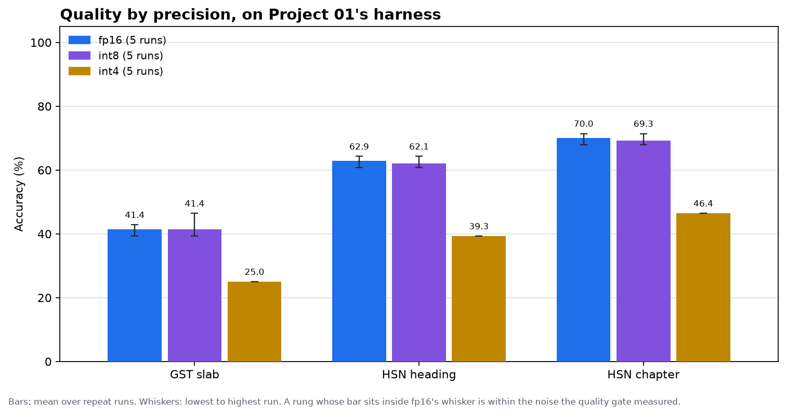
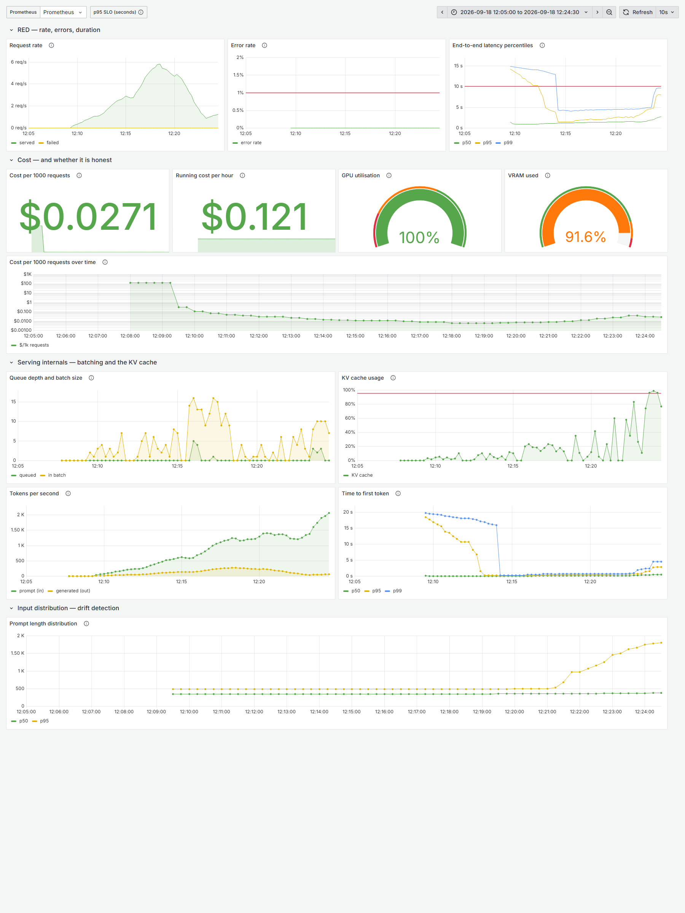

# Serving an open-weight LLM for GST classification: latency, quality and cost

**What does inference actually cost, and does self-hosting beat the API?**
This repository answers that for one model, one task and one deployment, with
measurements rather than estimates — and publishes the curves.

The task comes from [Project 01](https://github.com/ardhendudebnath/gst-eval-harness):
classifying Indian goods into the GST slab that is *currently* in force, after
two restructures in under two years. That project scores quality. This one adds
latency and cost, so all three sit in the same frame.

The write-up: [What it actually costs to self-host Qwen3-4B for GST
classification](docs/post.md).

> **Status: the whole ladder is measured. The crossover is priced, but not yet
> quality-matched.**
>
> fp16, int8 and int4 have each been served, load-tested on all three workload
> profiles and scored five times on Project 01's harness. Their numbers and
> charts are below. The crossover is drawn against Claude Haiku 4.5's list
> price and labelled as not quality-matched, on the chart itself, because
> Haiku has not been scored on this task.
>
> This section will keep saying what is missing until nothing is. Project 01
> holds the same line, and it is the reason its numbers are worth reading.

---

## The headline

> Self-hosting Qwen3-4B on an RTX 5070 Ti laptop costs less than Claude Haiku
> 4.5's list price above **about 47,000 `long_in` requests a month**, at a p95
> of **10 s**, at fp16 or int8 alike. **This is not quality-matched**: this
> model gets 41.4 % of slabs right, and Haiku has not been scored on the task.


- **The break-even sits at 0.9 % GPU utilisation.** The laptop costs ₹7,762 a
  month at its amortised rate, whether it serves or not. That is what Haiku
  would charge for 47,423 `long_in` requests at ₹0.164 each, from its list
  price of $1 and $5 per million input and output tokens (read 2026-06-24).
  The self-hosted floor is ₹0.0015 a request, about 110 times less.
- **It is the same at every precision.** One card covers the crossover volume
  about a hundred times over, so its capacity never binds there, and
  quantisation cannot move the crossover. The
  [fp16 chart](docs/charts/crossover-fp16.png) is the same curve with a
  different title. int4 is not drawn: its quality gate verdict is blocked, and
  the report publishes no cost for a rung that fails on quality.
- **Why it is only a price comparison.** The honest comparison matches on
  quality first, then compares cost. A 41 % model's cost set against the price
  of a model that may score far higher prices two different products. It is
  also charged this model's token counts rather than Haiku's own, prices the
  laptop as if dedicated around the clock, and assumes flat traffic. Scoring
  Haiku on Project 01, for about ₹40, would make it a real answer.

---

## Measurements

| | fp16 | int8 (W8A16) | int4 (W4A16) |
|---|---|---|---|
| Latency vs load, three workload profiles | measured | measured | measured |
| Quality on Project 01's harness, five runs | measured | measured | measured |
| GPU utilisation and throttling at each point | measured | measured | measured |
| Crossover against an API | charted | charted | withheld: gate blocked |

The crossover is priced against Claude Haiku 4.5's list price and is not
quality-matched. See the headline.

### Capacity at a p95 of 10 s



Qwen3-4B-Instruct-2507 on vLLM 0.11.0, one RTX 5070 Ti Laptop GPU,
`max_model_len` 4096, 16 sequences, prefix caching off. fp16 is the BF16
checkpoint, int8 is W8A16 built here, and int4 is RedHatAI's W4A16. Each load
point runs 150 s of Poisson arrivals after 60 s of idle. The knee is the
highest arrival rate whose p95 still meets the SLO. Latency against load for
each rung: [fp16](docs/charts/latency-vs-load-fp16.png) ·
[int8](docs/charts/latency-vs-load-int8.png) ·
[int4](docs/charts/latency-vs-load-int4.png).

| Profile | fp16 | int8 | int4 |
|---|---:|---:|---:|
| `short` | **8 rps** · p95 1.78 s | **8 rps** · p95 1.38 s | **8 rps** · p95 1.88 s |
| `long_in` | **2 rps** · p95 4.82 s | **2 rps** · p95 4.94 s | **2 rps** · p95 3.75 s |
| `long_out` | **none** | **0.25 rps** · p95 9.35 s | **1 rps** · p95 8.20 s |
| one 768-token reply, unloaded | about 20 s | about 9 s | about 5.7 s |

Every rung fails at the next rate up: 16 rps on `short`, 4 rps on `long_in`.
At 16 rps the load generator also fell behind schedule for fp16 (21.9 s) and
int4 (662 s), so those two points measure the client as much as the server.

- **Quantisation buys no capacity on the task's own profile.** `long_in` is
  prefill-bound, and weight-only quantisation mostly saves memory bandwidth,
  which is what bounds decode. All three knees land at 2 rps. int8 is faster
  than fp16 at low load but no faster at 2 rps. At 4 rps the rungs do
  separate, with p95 209.7 s at fp16, 60.3 s at int8 and 41.1 s at int4. That
  says int4's true knee sits nearer 4, but the doubling ladder is too coarse to
  say how much nearer.
- **`long_out` is where quantisation changes the answer.** At fp16 a lone
  768-token reply takes about 20 s, so a 10 s total-latency target is
  unmeetable at any load. int8 takes about 9 s and meets the target at
  0.25 rps; its 0.5 rps point misses by 0.04 s. int4 takes about 5.7 s and
  meets it up to 1 rps. Decode is bound by memory bandwidth, and 8-bit and
  4-bit weights move about a half and a quarter of the bytes per step. Part of
  the gap is power state: the card's clock ran at about 39 % of maximum
  through fp16's `long_out`, against about 85 % for int8 and 82 % for int4.
  (Read against a 30 s target, fp16's points would put its knee at 0.5 rps.
  That target was chosen after seeing the data, so nothing downstream uses
  it.)
- **The card was power-capped for 76–100 % of busy samples** at every knee
  above. Every throughput figure here is a floor. See Limitations.

### Quality on Project 01's harness



Five runs per rung against the same server, greedy decoding, 28 rows. Each
cell is the mean, with the lowest and highest run in brackets:

| Metric | fp16 | int8 | int4 |
|---|---:|---:|---:|
| Slab accuracy | 41.4 % (39.3–42.9) | 41.4 % (39.3–46.4) | 25.0 % |
| HSN accuracy | 62.9 % (60.7–64.3) | 62.1 % (60.7–64.3) | 39.3 % |
| Chapter accuracy | 70.0 % (67.9–71.4) | 69.3 % (67.9–71.4) | 46.4 % |
| Abstention accuracy | 100 % | 100 % | 60.7 % |
| Stale-slab rate | 5.0 % (3.6–7.1) | 5.7 % (3.6–7.1) | 3.6 % |
| Unparseable | 0 % | 0 % | 0 % |

Greedy decoding still moved. fp16's runs differ by one row out of 28, which is
3.57 points, and int8's by two. vLLM does not guarantee identical output
across different batch compositions. fp16's measured spread is the quality
gate's tolerance. int4 scored identically on all five runs. For scale, the
frontier reference in Project 01 averages about 54 % on the same rows.

**int8 matches fp16.** Its five-run mean slab accuracy is exactly fp16's. The
gate passes it ([`gate.md`](results/eval/int8/gate.md)) and shows +5.0
points, but that compares only the newest run, which was int8's best; the
mean shows no change. Row by row, int8 gives the same answer as fp16 on 26–28
of 28 rows against each fp16 run, and never newly abstains
([`rows-vs-fp16.md`](results/eval/int8/rows-vs-fp16.md)). It was built
round-to-nearest, the weaker method, so GPTQ could only have closed a gap, and
there is none to close.

**int4 did not forget the slabs; it stopped answering.** The gate blocks it on
four metrics, each far outside fp16's noise floor
([`gate.md`](results/eval/int4/gate.md)). The row-by-row comparison
([`rows-vs-fp16.md`](results/eval/int4/rows-vs-fp16.md)) shows how. Against
every one of fp16's five runs, int4 says `UNANSWERABLE` on the same 11 rows
that fp16 answered, loses 4–5 correct answers and gains none. Where both
commit to a slab, they agree on every row but one, in one fp16 run, where both
were wrong. All of the lost accuracy is abstention.

That matters for what would fix it. A model that had lost the knowledge would
need more bits. One that has lost confidence might be recovered by a prompt
that discourages abstaining, which could be tested without changing precision.
It has not been tested here.

### The three workload profiles

Real request patterns from the domain, not synthetic uniform load. All three
are built from traffic Project 01 collected, and the prompts are rendered by
importing its `harness.prompt` — so a load test replays the exact bytes a
quality run sends.

| Profile | Shape | Median prompt | Output cap | Stands for |
|---|---|---:|---:|---|
| `short` | brief in, brief out | 606 chars | 48 tok | classifying a packaged retail product |
| `long_in` | long in, brief out | 7,177 chars | 48 tok | **Project 01's task** — reading an advance ruling |
| `long_out` | brief in, long out | 446 chars | 768 tok | writing a classification note |

They stress different parts of the server, which is the point of measuring all
three. `long_in` is prefill-bound with a large KV cache per sequence;
`long_out` is decode-bound and is where continuous batching separates most
clearly from static batching; `short` fills the batch with many small
sequences. A test asserts they stay an order of magnitude apart in shape, so
the sweep cannot quietly become one measurement repeated three times.

`short` and `long_out` are sampled from *disjoint* products, so running one
after the other cannot benefit from a prefix cache the other warmed.

---

## What's in the cost figure — and what isn't

Stated before any number exists, so it cannot be written to fit the result.

**In it:** the GPU's hourly cost, meaning amortised purchase price plus
electricity, for every hour of the month. A card costs the same idle as busy.

**Not in it:**

- engineering time — building this took far longer than the GPU it measures
- on-call, and the people to do it
- redundancy: these figures are for **one replica**, which is not a production
  posture. A second for availability doubles the GPU line.
- idle capacity beyond what the peak-to-mean ratio models
- storage, egress, and the control plane
- the cost of being wrong — an API provider absorbs a bad deploy; you do not

**The rate is what an hour of the card costs, not what this project paid.** The
measurements run on a laptop the author already owned, so the cash spent on GPU
time was zero. Reporting the cost as zero would put the crossover at one request
a month and make the chart worthless. Every published figure instead uses the
card's amortised cost: ₹2,49,990 over three years, plus electricity at its 140 W
power limit, priced as available around the clock. That comes to **₹10.63 an
hour**. What the project itself spent is a separate number and lives in
[`docs/cost-log.md`](docs/cost-log.md). Keeping the two apart is deliberate:
one answers "what would this cost to run", the other "what did this cost its
author", and collapsing them answers neither.

`bench/config.py` refuses to produce a cost figure from an unread rate —
`UnpricedError`, not a plausible default.

### Self-hosted cost is a step function

A GPU bills the same idle as saturated, so monthly cost is flat across each
card's capacity and then jumps. The API side is linear through the origin with
no floor. Drawn honestly the self-hosted cost-per-request is a sawtooth: it
falls as a card fills, then jumps when the next one is needed.

A smooth line on that chart means the author divided one number by another and
stopped.

---

## Operations

**Serving.** vLLM, containerised, pinned to an exact tag. Continuous batching
and paged KV cache are the whole reason for using a real serving stack rather
than a Flask wrapper around `model.generate()` — they are what the measurements
are about.

Prefix caching is **off** for measurement runs. The corpora hold 60–200
prompts and a long run replays them; cached replays would report a hit rate
that real traffic — where every advance ruling is a different document — never
reproduces. Measuring what it buys is a separate row, not a free boost.

**Kubernetes.** Deployment, Service, PVC, HPA, and three probes that each do a
different job:

- a **startup probe** with a 10-minute budget, which is what allows the other
  two to be sane rather than needing long initial delays;
- a **readiness probe** that fails fast (3 × 5s) so a broken pod leaves the
  endpoint list quickly, with `timeoutSeconds: 3` — well below any real
  completion, because `/health` does no inference, so failing it means the
  event loop is blocked rather than the server being busy;
- a **liveness probe** that is deliberately the least sensitive (30s × 6 = 3
  minutes). A saturated model server is slow, not dead. Restarting it under
  load turns a traffic spike into an outage: the restart drops in-flight work
  and takes minutes to return.

**The HPA scales on queue depth, not CPU.** A vLLM process sits at ~15 % CPU
while the GPU is saturated and the queue is 200 deep, so a CPU-driven HPA
refuses to scale exactly when the SLO is failing. Its honest limit is written
into the manifest: a new replica needs minutes to load weights, so it cannot
absorb a sudden spike, and against a 10× burst what actually protects the SLO
is bounded queueing plus shedding at the ingress.

**Run on k3s, and what happened.** The deployment runs on a single-node k3s
cluster inside the same WSL2 VM, with NVIDIA's device plugin
([`nvidia-device-plugin.yaml`](deploy/k8s/nvidia-device-plugin.yaml)). The
plugin gained WSL2 support in v0.19.1.

- **The startup probe did its job.** The pod was Ready about 110 s after it
  was created. Until then the startup probe got "connection refused" and held
  readiness and liveness off, as designed.
- **Ready was not warm, and now is.** `/health` passes once the model is
  loaded. But a batch of eight requests sent the moment the pod turned Ready
  waited 18.1–18.8 s for a first token; that is the left edge of the
  time-to-first-token panel below. The same batch 30 s later took 0.3–0.9 s.
  A `postStart` hook now sends two batches of throwaway requests before any
  probe runs, and it absorbs the cost: its first batch took 18.6 s, its second
  0.8 s. Measured the same way after the fix, the first batch at Ready took
  0.08–0.68 s. The price is about 30 s more before the pod turns Ready.
- **A zero-downtime rollout cannot fit on this node.** With `maxSurge: 1`, the
  new pod needs a second GPU and a second 8 GiB while the old one serves, and
  it sat Pending on both. The Deployment now rolls with `maxUnavailable: 1`
  instead. That costs about two and a half minutes of downtime per rollout,
  which a single-GPU node cannot avoid.
- **The pod died whenever WSL shut the distro down.** WSL stops a distro
  seconds after its last `wsl.exe` session exits, and k3s and the pod go with
  it. When the distro next boots, the kubelet re-admits the pod before the
  NVIDIA device plugin has re-registered. It fails with "no healthy devices"
  and shuts the pod down, and the ReplicaSet replaces it. This happened twice
  before the cause was clear. It was first misread as an out-of-memory
  failure, because on startup the kubelet replays old kernel OOM kills as fresh
  `SystemOOM` events; that one was a calibration run the day before. The fix
  is a keepalive: one `wsl.exe` session left open for as long as the cluster
  should run ([`docs/setup.md`](docs/setup.md) §4b). Under load the pod uses
  about 3.5 GiB, and its memory request is now sized to this node rather than
  to a cloud VM.
- **The HPA reports `<unknown>`,** as its manifest warns. No
  prometheus-adapter is installed, so the queue-depth metric never reaches it.
  The `AutoscalerMetricUnavailable` alert does not catch this. It checks that
  Prometheus has the metric, which it does, and cannot see that nothing serves
  the metric to the HPA.



The dashboard during about 17 minutes of load on the k3s pod: `short` at 2, 4
and 8 rps, then `long_in` at 1 and 2 rps. The GPU panels come from
[`wsl-gpu-exporter.py`](deploy/observability/wsl-gpu-exporter.py), a stand-in
for DCGM, which cannot run under WSL2. [`wsl-up.sh`](deploy/observability/wsl-up.sh)
brings the stack up. The load went through a `kubectl port-forward`, so its
latencies sit above the published podman measurements (p95 2.24 s against
1.78 s on `short` at 8 rps), and they are not used anywhere else.

**Running the stack found two alerts that could never fire.** The dashboard
and alert rules read `vllm:gpu_cache_usage_perc` and
`vllm:request_failure_total`, and vLLM 0.11 exports neither. A query over a
missing metric returns nothing, so their panels were blank and their alerts
silent. The rules now read `vllm:kv_cache_usage_perc` and the API server's
`http_requests_total`. A test checks every series the dashboard and rules read
against the metric families a live server exported.

**Alerting.** Thresholds are derived, not round — see
[`deploy/observability/rules.yml`](deploy/observability/rules.yml):

| Alert | Threshold | Why that number |
|---|---|---|
| p95 over SLO | > 10 s, 5 min | the SLO the knees and cost curves were measured against; a test holds the alert, the dashboard and the sweeps to one number |
| Error rate | > 1 %, 5 min | the same ceiling `find_knee()` uses to disqualify a load point, so the alert and the benchmark share one definition of "working" |
| **GPU underutilised** | < 20 %, 30 min | a **cost** alert: below this the per-request figure is dominated by idle time and the API almost certainly wins |
| KV cache | > 95 %, 10 min | leading indicator — preemption shows up as a latency tail before it shows up as errors |
| Prompt-length drift | 1.5× vs 7d ago | compared against the same hour last week so weekday shape does not fire |

---

## The quality gate

A serving change that degrades measured quality does not merge.

**The hard part is not comparing two numbers — it is knowing which differences
mean anything.** Project 01 ran one model over the same 28 examples five times
with identical inputs and got slab accuracies of **53.6, 50.0, 53.6, 50.0,
64.3**: a 14.3-point spread from sampling alone. A "fail on any 1-point
regression" rule would have blocked three of those five runs against any of the
others, and would have been switched off inside a week. A gate nobody trusts is
worse than no gate, because it launders a rubber stamp as a control.

So **tolerance is measured, not chosen.** `gate/record.py` takes repeat runs of
one configuration and banks their observed spread; `gate/compare.py` requires a
candidate to move a metric further than that before calling it a regression,
and **refuses to run at all** when the noise floor is unmeasured, when the
dataset SHA has changed, or when the prompt version has changed. Exit code 2,
not 1 — "cannot judge" is a different outcome from "judged and failed".

A 9-point drop passes this gate. A test says so out loud, and the PR comment
shows the tolerance and where it came from, because a reviewer who cannot see
why a 9-point drop passed will not trust it.

**CI has no GPU, and the pipeline does not pretend otherwise.** A workflow
claiming to run the eval would be green because it never ran. What a free
runner enforces is that a change altering model output *arrives with a scored
run attached* — `gate/guard.py` blocks the merge otherwise — and that the run
clears the baseline. The full build → serve → score loop exists as `gate-live`,
conditioned on a GPU runner actually existing rather than left permanently
pending.

**What it has caught: the int4 rollout.** The branch
[`demo/int4-regression`](https://github.com/ardhendudebnath/llm-serving-unit-economics/tree/demo/int4-regression)
does what a real int4 rollout would do: it switches the ConfigMap to RedHatAI's
W4A16 checkpoint and attaches one of the int4 harness runs. Run as CI runs it,
the guard is satisfied, because a scored run is attached, and hands the change
to the compare step. That step blocks it on four metrics, each far outside the
fp16 noise floor: slab accuracy −16.4 points, HSN −23.6, chapter −23.6 and
abstention −39.3 ([the full table](results/eval/int4/gate.md)). The row
comparison explains the loss: int4 declines to answer on 11 rows that fp16
answers.

*Screenshot of the blocked pull request: pending, until that branch is opened
as a PR on GitHub.*

---

## Reproducing

> **Cost warning first.** The measurement runs need a GPU. Everything else —
> container, manifests, dashboards, load generator, cost model, gate — runs on
> CPU and costs nothing. Set a hard billing alert before renting anything.
>
> For the GPU side, [`docs/setup.md`](docs/setup.md) is the runbook: WSL2, the
> Blackwell kernel check to do *before* downloading weights, and the KV-cache
> arithmetic that decides batch size at 12 GB.

```bash
git clone https://github.com/ardhendudebnath/llm-serving-unit-economics
cd llm-serving-unit-economics
python -m pip install -e '.[dev,load,charts]'
python -m pytest tests -q                 # 241 tests, no GPU
python -m pytest tests -q -m "not e2e"    # 227 of them, in about 4 seconds
```

**The whole toolchain runs without a GPU.** `tests/mock_server.py` speaks vLLM's
wire format — same SSE framing, same role-only first delta, same trailing usage
chunk — with latency that is specified rather than measured. Start it and drive
a real sweep against it:

```bash
python -m tests.mock_server --port 8099 --ttft-ms 120
python -m bench.sweep --all-profiles --base-url http://localhost:8099 --slo 2.0
python -m bench.report.build
```

The dashboards run on CPU too:

```bash
podman compose -f deploy/observability/docker-compose.yml up
```

On a box with no compose provider, as on the WSL2 machine this was measured on,
`make observability-wsl` runs the same two containers with plain podman. It
also points Prometheus at the pod in k3s and at an `nvidia-smi` stand-in for
DCGM, which cannot run under WSL2.

Rebuild the workload corpora from Project 01 (only needed if its data changes):

```bash
python -m bench.build_corpus --harness ../domain-eval-harness
```

One GPU block, end to end — spin up, sweep, collect, destroy:

```bash
# Weights live on the host, not in an engine-managed volume -- see
# docs/setup.md for why that lesson was expensive.
podman run -d --device nvidia.com/gpu=all -p 8000:8000 --shm-size 2g \
  --env-file serving.env -v /opt/llm-models:/models \
  localhost/llm-serving:local
python -m bench.sweep --all-profiles --precision fp16 --slo 10 \
  --duration 150 --warmup 15 --cooldown 60
```

`make serve ENGINE=docker` still works; the Dockerfile and manifests are
engine-agnostic.

On the cluster rather than the container, with the device plugin that makes
the GPU allocatable:

```bash
make k8s-up KUBECTL="k3s kubectl"     # manifests + nvidia-device-plugin.yaml
make k8s-status KUBECTL="k3s kubectl" # pods, services, and the pod's events
```

The 8-bit rung is built here rather than downloaded, because no W8A8 checkpoint
runs on this card. It takes about 90 seconds and writes its settings beside the
weights:

```bash
mkdir -p /root/quantize && cp quantize/run.sh quantize/w8a16.py /root/quantize/
/root/quantize/run.sh                 # see quantize/w8a16.py for why RTN
```

Render the charts with the caveat the crossover currently carries:

```bash
make charts                           # keeps the not-quality-matched label
```

The sweep checkpoints after every point, so a preempted spot instance loses one
point rather than the run, and it stops climbing once p95 is 3× over the SLO
rather than paying to measure how badly a server fails.

Score the same server on Project 01's harness — same wire format, so only the
base URL differs:

```bash
NIM_BASE_URL=http://localhost:8000 NIM_MODEL=<served id> \
  python -m harness.run --model open-weight-vllm
```

---

## Limitations

Written before the measurements, so none of it is retrofitted.

- **One GPU, one replica, one region.** No high availability, no failover, and
  the cost figures reflect that. A production posture costs more.
- **Poisson arrivals are not real traffic.** They are far better than uniform
  load, but they have no diurnal cycle and no correlated bursts. The
  `peak_to_mean` parameter exists to model burstiness explicitly and defaults
  to 1.0 — a perfectly flat month, which no service has — because a different
  default would bury an assumption inside a headline.
- **28 golden rows.** Project 01's dataset is small and gazette-derived rather
  than human-labelled; every quality number here inherits that, including the
  gate's baseline.
- **A p99 over a short run is the maximum under another name.** Every
  distribution carries its `n`, and `p99_from_thin_tail` is flagged when
  `n < 100`.
- **The quantisation ladder needs pre-quantised checkpoints.** int8 and int4
  are not runtime flags; if no suitable checkpoint exists for the chosen model,
  that rung is missing rather than faked.
- **12 GB of VRAM bounds the model.** Measurements run on an RTX 5070 Ti
  Laptop GPU — 12,227 MiB, driver 595.79, compute capability 12.0, read from
  `nvidia-smi` on 2026-09-07 rather than inferred from the model name. An 8B
  model needs ~16 GB of fp16 weights before any KV cache, so it does not fit;
  the fp16 rung is the baseline every quality delta is measured against, so the
  model is sized to keep it rather than starting the ladder at int8.
- **The card is power-capped, and it changes the measurement, not just the
  numbers.** Measured: SW Power Cap was active for essentially every sample of
  every load point, with mean SM clock at **29–82 % of the rated 3,090 MHz**.
  It is *power*-limited rather than thermally limited — peak temperature was
  81 °C, well inside spec, and the limit is already raised to its 140 W
  maximum. Every throughput figure here is therefore a **floor**.

  The consequence is worse than slow numbers: **consecutive load points are not
  independent measurements.** Each inherits the power state the previous one
  left behind. Run back to back, the `short` profile produced a p95 of 37.5 s
  at 2 rps; with 60 s of idle between points it produced **1.36 s at the same
  rate**, a 27× difference, and the curve stopped being non-monotonic.

  So sweeps use `--cooldown`, and the reason is not tidiness. A knee is a curve
  *across* rates, and a curve is only meaningful if each point measures the
  same system. The honest caveat is that a cooled point measures burst-from-idle
  performance, which flatters a server that in production never gets to cool
  down — characterising sustained throughput needs a separate long steady-state
  run at a fixed rate, and that is a different measurement from the knee.

  Both versions are kept under `results/sweeps/contaminated/` rather than
  deleted, because the difference between them is itself a finding.

  It happened a second time, across a profile boundary. The sweep cooled
  between its own points but not before its first, so int4's `long_in` opened
  straight after `short` had been saturated for about 13 minutes. It recorded
  p50 13.5 s at 0.25 rps, and that one hot point read as "no rate met the
  SLO". Re-measured after the cooldown, the point is p95 1.09 s and the knee is
  2 rps. The sweep now cools before every point, and the hot version is kept
  under `results/sweeps/contaminated/` as well.

  A third contamination came from outside the benchmark. int8's first `short`
  point ran at 93 % GPU utilisation and about 250 ms per decode step, while
  vLLM's own stats showed only 1–8 requests in flight. This card also drives
  the laptop's display, so any other GPU work on the desktop competes with the
  server. A browser was later seen holding the GPU, which fits but does not
  prove it. Re-measured, the point is p95 0.98 s at 21 % utilisation. The
  sweep's utilisation figure is the whole card's, so it cannot tell the
  server's work from anyone else's.
- **The 8-bit rung is W8A16, not W8A8.** RedHatAI's W8A8 checkpoint loads and
  then fails on its first forward pass. vLLM 0.11.0's only int8 activation
  kernel on CUDA is CUTLASS, which does not support compute capability 12.0
  ([`FAILED.md`](results/eval/int8-w8a8/FAILED.md)). So the ladder does not
  measure int8 *activation* quantisation. The 8-bit rung is built here in the
  int4 rung's weight format (int8, group 128, MSE observer), but
  round-to-nearest rather than GPTQ ([`quantize/`](quantize/)). GPTQ
  calibration ran the WSL VM's 15 GB out of memory at every size tried. So
  int8 and int4 differ in method as well as bits, and that difference cuts one
  way: round-to-nearest is the weaker method.
- **vLLM runs in WSL2, and says so itself.** It logs `Using 'pin_memory=False'
  as WSL is detected. This may slow down the performance.` Host-to-device
  transfers therefore cannot use pinned memory, which costs most on the
  prefill-heavy `long_in` profile. Every throughput number here is a **floor**
  relative to the same card on bare-metal Linux, and the gap is unmeasured.
- **This card cannot be rented, which is a real problem for the cost curve.**
  No cloud offers a laptop 5070 Ti, so there is no provider rate to read.
  Pairing locally-measured throughput with some other card's hourly price would
  describe a machine that does not exist. So the card is priced from what it
  cost, in `OwnedHardware` in `bench/config.py`, with every input sourced. Two
  inputs are assumptions and are labelled as such: a three-year life and an
  ₹8/kWh tariff. The tariff barely matters. The whole ₹3–14 range of state
  tariffs moves the hourly rate by ₹1.54.

  **Duty cycle is a trap here.** Cost per *serving* hour moves about 11×
  between serving 24 hours a day and 2 (₹10.63 to ₹115.27). The crossover must
  not use those figures. It already bills the card for every hour of the month
  and shows idle time as low utilisation, so pricing the card at a partial duty
  cycle as well would count the idle hours twice. An early version made exactly
  that mistake. The crossover now uses the around-the-clock rate, and a test
  holds it there.
- **The API side is charged the self-hosted model's token counts.** The
  crossover prices each API request at the input and output tokens vLLM
  counted for Qwen3-4B. The API model's own tokenizer counts the same text
  differently, and neither the size nor the direction of that gap is measured,
  so the API line could sit somewhat higher or lower. Scoring the API model on
  Project 01 would record its real token usage on the same prompts and close
  the gap.

---

## Layout

```
bench/       config (dated prices, amortisation) · metrics (percentiles,
             knee) · cost (step function, crossover) · workloads · loadgen
             (open-loop, Poisson) · sweep (checkpointing) · gpu (VRAM,
             throttle detection) · build_corpus · report/ (charts, build,
             rows — how a rung got worse, not just by how much)
gate/        compare (noise-floor tolerance) · record · guard
quantize/    w8a16.py · run.sh — the 8-bit rung, built here because no W8A8
             checkpoint runs on this card
serving/     Dockerfile · entrypoint.sh
deploy/      k8s/ (deployment with a warm-up hook, service, hpa, configmap,
             nvidia-device-plugin)
             observability/ (prometheus.yml, rules.yml, grafana dashboard,
             docker-compose for the CPU-side stack, wsl-up.sh and
             wsl-gpu-exporter.py for WSL2)
tests/       mock_server.py — a fake vLLM, so the toolchain runs with no GPU
data/        workloads/ — the three replayable corpora
docs/        post.md (the write-up) · decision.md · cost-log.md · models.md ·
             setup.md (the runbook) · charts/ · screenshots/
results/     sweeps/ (with contaminated/, kept as evidence) · eval/ — per rung,
             with each gate verdict and row-by-row comparison
```

## Licence

MIT. See [LICENSE](LICENSE).
