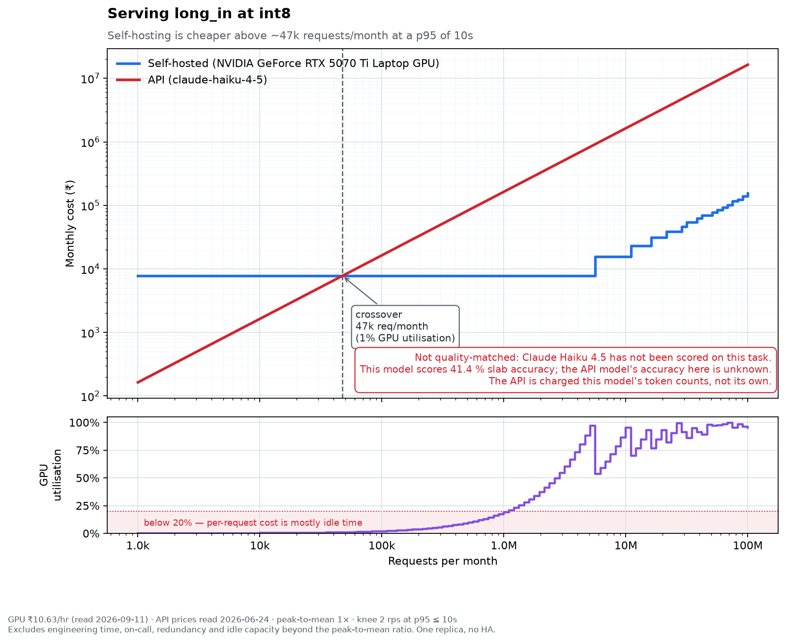

# What it actually costs to self-host Qwen3-4B for GST classification

*Draft. Every number below comes from a measurement in this repository. The
one comparison that is not yet quality-matched is marked as such.*

The question every team serving a model gets asked is short: what does
inference cost us, and would self-hosting be cheaper? I wanted an answer in
rupees, from measurements rather than a vendor's page, for one real task:
classifying Indian goods into the GST slab currently in force. My [Project
01](https://github.com/ardhendudebnath/gst-eval-harness) already scores
models on that task. This project serves one open-weight model, loads it, and
prices it.

## The setup

- **Model:** Qwen3-4B-Instruct-2507, served by vLLM 0.11.0 at three
  precisions: 16-bit (8.04 GB), int8 weight-only (5.25 GB) and int4
  weight-only (3.43 GB).
- **Hardware:** my own laptop, an RTX 5070 Ti Laptop GPU with 12 GB, under
  WSL2. No cloud GPU was rented.
- **Price of an hour:** ₹10.63. That is the laptop's ₹2,49,990 spread over
  three years, plus electricity at the card's 140 W limit, charged as if the
  card were available around the clock. Owned hardware is not free to serve
  on, and a cost curve drawn at ₹0 would be worthless.
- **Load:** open-loop Poisson arrivals, three request shapes taken from the
  task, and a 10 s p95 target. The *knee* is the highest arrival rate that
  still meets it.

## What one card serves

| Request shape | fp16 | int8 | int4 |
|---|---:|---:|---:|
| `short`: brief prompt, brief answer | 8 req/s | 8 req/s | 8 req/s |
| `long_in`: an advance ruling in, a slab out (the task itself) | 2 req/s | 2 req/s | 2 req/s |
| `long_out`: brief prompt, a 768-token note out | none | 0.25 req/s | 1 req/s |

Two things surprised me.

**Quantisation buys no capacity on the task's own shape.** `long_in` is
prefill-heavy, and weight-only quantisation mostly saves memory bandwidth,
which is what bounds decode. All three precisions reach the same 2 req/s. Past
that there is no gentle slope: at 4 req/s, p95 goes to 210 s at fp16, 60 s at
int8 and 41 s at int4. The queue takes over completely.

**Where quantisation does help is long answers.** A lone 768-token reply takes
about 20 s at fp16, so a 10 s target cannot be met at any load. It takes about
9 s at int8 and 5.7 s at int4. Part of that gap is the laptop's power cap: the
card ran at about 39 % of its clock through the fp16 run and over 80 % through
the quantised ones.

## What it costs

At 2 req/s on `long_in`, one card could serve 5.26 million requests a month if
traffic were perfectly flat. At full utilisation, that puts the floor at
**₹1.48 per 1000 requests**.

The floor is where the honesty problem starts. The card costs ₹10.63 an hour
whether it serves 2 requests a second or none, about ₹7,760 a month. On the
live dashboard, cost per 1000 requests ran from about $100 while traffic was
ramping up to about $0.01–0.03 under load. A per-request cost figure with no
GPU utilisation next to it is not a cost figure. That is why the dashboard
shows both, and why one alert fires on an idle GPU as a cost problem, not a
reliability one.

## Quantisation: 8 bits hold, 4 bits don't, and not for the reason I expected

| On Project 01's harness, 28 rows | fp16 | int8 | int4 |
|---|---:|---:|---:|
| Slab accuracy, mean of five runs | 41.4 % | 41.4 % | 25.0 % |
| HSN accuracy | 62.9 % | 62.1 % | 39.3 % |
| Answered when it should have | 100 % | 100 % | 60.7 % |

int8 matches fp16: the same five-run mean, and the same answer on 26–28 of 28
rows against each fp16 run. int4 loses 16 points of slab accuracy. The
automated quality gate blocks it on four metrics, each far outside the noise
floor measured by repeating fp16 five times.

The row-by-row comparison is the finding. **int4 did not forget which slab
goods belong in; it stopped committing to an answer.** It says `UNANSWERABLE`
on 11 of the 28 rows that fp16 answered, and those abstentions account for
all of its lost accuracy. Where it does answer, it agrees with fp16. That
matters for the fix. A model that has lost knowledge needs more bits; one that
has lost confidence might be recovered by a prompt that discourages
abstaining. I have not tested that.

## Would I self-host this?

On price alone, yes, above about 47,000 requests a month. Against Claude
Haiku 4.5's list price, the laptop's ₹7,762 a month (the amortised rate,
around the clock) buys what Haiku would charge for 47,423 `long_in` requests
at ₹0.164 each. At that volume the GPU is busy 0.9 % of the time. The API
charges about 110 times the self-hosted floor per request, so even a nearly
idle card wins.

But that is price alone, and the chart says so on its face. The honest
comparison matches quality first. This model gets 41.4 % of slabs right,
Project 01's frontier reference gets about 54 %, and Haiku has not been scored
on this task. If Haiku lands well above 41 %, the chart compares two different
products, and quality decides the question rather than cost. Scoring it would
cost about ₹40, and it is the next thing to do.

What the measurements already settle:

- **int4 is out at any price.** The gate blocks it.
- **int8 is the better single choice on this card.** It has fp16's quality,
  about two-thirds of the memory, and more than twice the decode speed.
- **No precision lowers the cost floor on the task itself,** because none adds
  `long_in` capacity.

## What the measurement taught me about measuring

Most of the work was not the benchmark. It was noticing when the benchmark was
wrong.

- **Consecutive load points were not independent.** On a power-capped laptop,
  each point inherited the thermal state of the one before. Run back to back,
  one point read p95 37.5 s; after 60 s of idle, the same point read 1.36 s,
  27 times faster. The sweep now cools before every point. That includes the
  first one, which I learned when a hot first point made int4 look as if it
  could meet the target at no rate at all.
- **The GPU also drives the display.** One int8 point ran about ten times
  slower than its neighbours while vLLM had only a handful of requests in
  flight. Something outside the benchmark was using the card.
- **The planned int8 checkpoint cannot run here.** vLLM 0.11.0 has no int8
  activation kernel for this Blackwell GPU. I built a weight-only int8 instead,
  round-to-nearest, because GPTQ calibration needed more RAM than WSL had.
- **Two alerts could never fire.** They read metric names vLLM no longer
  exports, and a query over a missing metric returns nothing rather than an
  error. I found them only by running the stack against a live server. A test
  now checks every metric the dashboard reads against what the server actually
  exports.

## What is not in ₹1.48

Engineering time, which dwarfed the GPU time. On-call. Redundancy: these
figures are for one replica. Idle capacity beyond what a flat month implies.
And the cost of being wrong, which an API provider absorbs and you do not.

The GPU time itself came to 4.72 hours of recorded measurement. At the
amortised rate that is worth about ₹50, with ₹0 of cloud spend and at most ₹5
of electricity.
